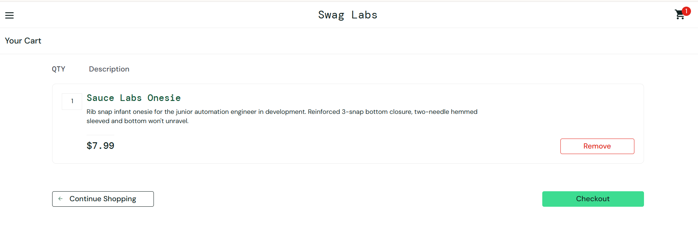
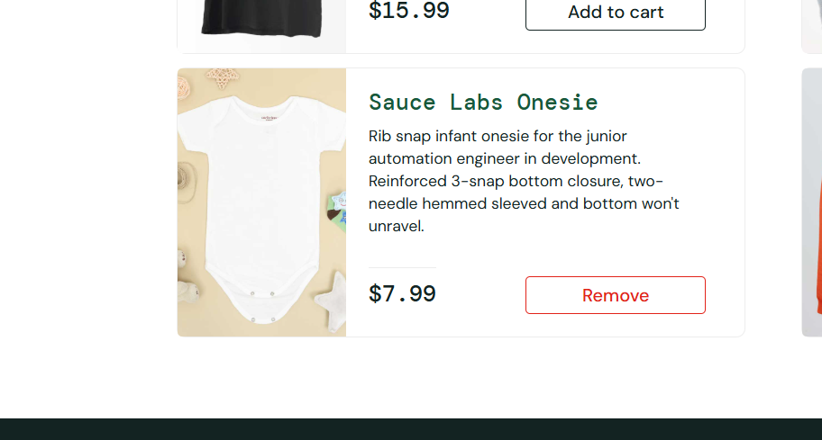

# Manual Testing Summary: SauceDemo (Swag Labs)

**Project Scope:** Audit of the end-to-end purchasing flow.  
**Platform:** Web (Chrome)  

---

###    Key Findings

#### 1. [Functional Bug] Restricted Item Quantity
- **Issue:** The inventory page and cart page do not provide a mechanism to increment item quantity.
- **Impact:** **High Business Impact**. Prevents users from purchasing multiple units, directly limiting potential revenue per order.

#### 2. [UI/UX Observation] Button State Persistence
- **Issue:** Once an item is added, the "Add to Cart" button is replaced by a "Remove" button with no secondary option to add more.
- **Recommendation:** Replace the "Remove" button with a quantity selector (+/-) to improve user experience.

---

###  Visual Evidence

**Screenshot 1: Read-only quantity field in the Checkout Cart**

**Screenshot 2: Persistent 'Remove' state on Inventory Page**
