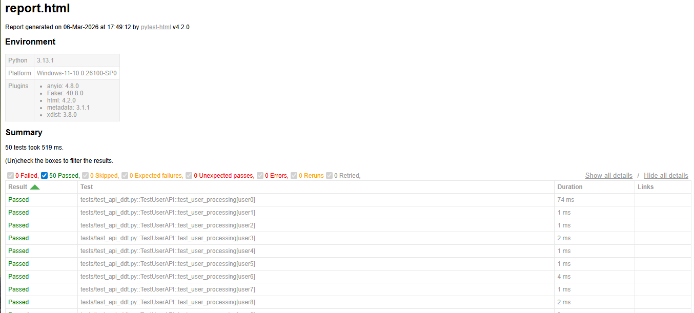

#  Advanced Python Data-Driven Testing (DDT) Framework

This project demonstrates a scalable, professional API testing architecture using **Pytest** and **Pandas**. It simulates testing a "User Management" API by dynamically generating large datasets and executing tests against them.

##  Test Execution Summary


---

##  Key Technical Features
* **Dynamic Data Engine:** Uses the `Faker` library to generate 50+ unique user records (names, emails, addresses) on the fly.
* **Data-Driven Architecture:** Decouples test logic from data using `Pandas` to inject CSV rows into test cases.
* **Custom Pytest Hooks:** Includes a `conftest.py` configuration to clean up HTML reports by removing sensitive or unnecessary environment variables (like `JAVA_HOME`).
* **Scalability:** The suite is designed to handle 5 or 5,000 test cases simply by changing the data generation parameters.

---

##  Project Structure
* `tests/test_api_ddt.py`: The core test logic using `@pytest.mark.parametrize`.
* `data/test_data.csv`: The auto-generated data source.
* `generate_mock_data.py`: A utility script to refresh the test data.
* `report.html`: A self-contained, shareable execution report.

---

##  How to Run Locally

1.  **Install Dependencies:**
    ```bash
    pip install pytest pytest-html pandas faker
    ```

2.  **Generate Fresh Data:**
    ```bash
    python generate_mock_data.py
    ```

3.  **Execute Tests & Generate Report:**
    ```bash
    python -m pytest tests/test_api_ddt.py --html=report.html --self-contained-html
    ```


